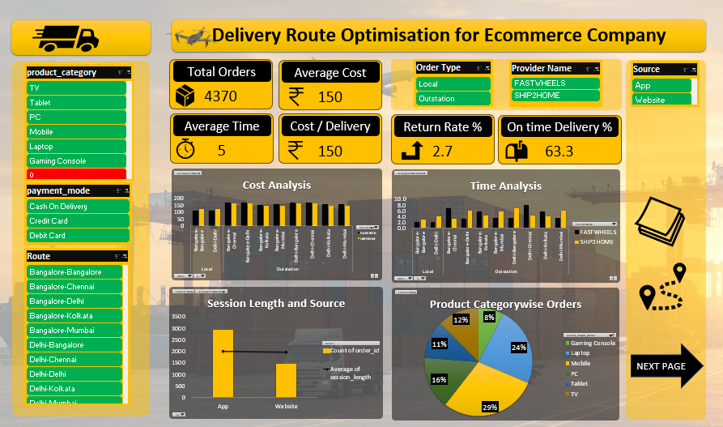

# 🚚 Delivery Route Optimisation for E-Commerce Company (Excel Project)

---

## 📌 Project Overview

This project focuses on optimizing delivery routes for an e-commerce company using Microsoft Excel.

The main objective is to:

- Reduce total delivery distance  
- Minimize fuel costs  
- Improve delivery efficiency  
- Optimize vehicle allocation  
- Enhance customer satisfaction  

The solution is fully developed in Excel using data analysis, formulas, and Solver-based optimization.

---

## 🎯 Business Problem

E-commerce companies manage large volumes of daily deliveries. Poor route planning can lead to:

- Increased fuel expenses  
- Delayed deliveries  
- Higher operational costs  
- Reduced customer satisfaction  

This project applies a data-driven optimization approach to improve route planning efficiency.

---

## 🛠️ Tools & Features Used

- Microsoft Excel  
- Excel Solver Add-in  
- Pivot Tables  
- Conditional Formatting  
- Data Validation  
- Advanced Excel Formulas (IF, SUMIFS, COUNTIFS, INDEX, MATCH, XLOOKUP)  
- Interactive Dashboard Design  

---

## 📊 Dataset Description

The dataset contains:

| Column Name        | Description |
|--------------------|------------|
| Order ID           | Unique order identifier |
| Customer Location  | Delivery destination |
| Warehouse Location | Dispatch center |
| Distance (KM)      | Distance between warehouse and customer |
| Delivery Time      | Estimated time for delivery |
| Vehicle Type       | Assigned vehicle |
| Fuel Cost          | Estimated fuel expense |
| Delivery Status    | Delivered / Pending |

---

## ⚙️ Methodology

### 1. Data Cleaning
- Removed duplicates  
- Standardized units  
- Handled missing values  

### 2. Distance & Cost Calculation
- Calculated total route distance  
- Estimated fuel cost per route  
- Derived cost per KM  

### 3. Optimization Using Solver
Objective:
- Minimize total delivery distance  
- Minimize fuel cost  

Constraints:
- Vehicle capacity  
- Delivery time limits  
- Route feasibility  

### 4. KPI Creation
- Total Deliveries  
- Average Delivery Time  
- Total Fuel Cost  
- Cost per Delivery  
- On-Time Delivery Percentage  

### 5. Dashboard Development
- Region-wise analysis  
- Vehicle performance tracking  
- Cost comparison charts  
- Interactive filters  

---

## 📈 Key Insights

- Identified high-cost delivery zones  
- Improved route efficiency  
- Reduced total fuel consumption  
- Optimized vehicle utilization  

---

